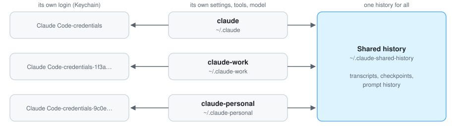

# claude-accounts

Several Claude Code accounts on one machine, each with its own login, all
sharing one conversation history. When one account hits its usage limit, the
next picks up the same thread with `--resume`.

```text
$ claude-accounts list
PROFILE            ACCOUNT                            CONFIG                   FLAGS
claude             you@example.com                    ~/.claude
claude-work        you@work.example                   ~/.claude-work           --model opus
claude-personal    you@personal.example               ~/.claude-personal

$ claude-work                 # Claude Code, logged into the work account
$ claude-personal --resume    # any thread, including ones started on work
$ claudech                    # pick an account interactively
```

<picture>
  <source media="(prefers-color-scheme: dark)" srcset="docs/images/profiles-dark.svg">
  
</picture>

## Install

Requires Claude Code (`claude --version` works) on macOS or Linux, with `bash`
and `curl`.

```bash
# Install, adding two profiles: claude-work and claude-personal
curl -fsSL https://raw.githubusercontent.com/maxim-golubev/claude-accounts/main/install.sh | bash -s -- work personal

# In a new terminal, log each new profile in once
claude-work auth login
claude-personal auth login

claude-accounts doctor        # checks everything, ends with "All good."
```

Plain `claude` keeps the login it already has; nothing is ever logged out.

## Commands

| Command | What it does |
| --- | --- |
| `claude …` | Claude Code on the stock profile (`~/.claude`), with its own login. |
| `claude-<name> …` | Claude Code on the profile `~/.claude-<name>`, with its own login. Every normal argument works (`--resume`, `-p`, `mcp`, `auth status`, …). |
| `claudech [args]` | Asks which account to use, then launches it with `args`. |
| `claude-accounts list` | Each profile, the account it is logged into, and its flags. |
| `claude-accounts doctor` | Checks PATH, launchers, logins, and history links, and says how to fix what is wrong. |
| `claude-accounts add <name> [flags…]` | Creates `claude-<name>`; then run `claude-<name> auth login`. |
| `claude-accounts repair` | Recreates the launchers and relinks shared history. Safe to run any time. |

Extra flags per profile (a default model, for example) live in
`~/.claude-wrappers/profiles.conf`.

## How it works

One Bash script of about 430 lines, built on four facts about Claude Code:

- **A login belongs to an exact path.** Claude Code names each login's Keychain
  item after a hash of the `CLAUDE_CONFIG_DIR` string, so every config
  directory is a separate login. That also makes `~/.claude-work/` (with a
  trailing slash) a different, empty login, so the script never rewrites or
  resolves these paths, and leaves the variable unset for the stock profile.
- **One script answers to every name.** Each launcher is a symlink to the same
  file, which reads the name it was called by, sets `CLAUDE_CONFIG_DIR`,
  clears any API key in the environment that would override the subscription
  login, and hands over to the real binary.
- **Updates need nothing.** The real Claude Code binary is found again on
  every launch, by following the link Claude Code's own updater moves, so
  `claude update` keeps working unchanged.
- **History is shared without losing any.** Each profile's transcripts,
  checkpoints, and prompt history are symlinks into one store. A profile that
  already has history is merged in: missing files move over, exact duplicates
  go, prompt history is de-duplicated and re-sorted by time, and real
  conflicts are kept in a dated folder.

The one thing that can break it is PATH order: an installer that later puts
`~/.local/bin` first makes `claude` skip the launchers. `claude-accounts doctor`
detects that and says how to fix it.

[How it works, in detail](docs/how-it-works.md), including configuration and
troubleshooting. Setting this up with an AI coding agent?
[The setup playbook](docs/agent-setup.md) walks it through, with the rules that
keep every existing login intact.

> Unofficial and not affiliated with Anthropic. It relies on how Claude Code
> stores logins and history today (verified on Claude Code 2.1.x and macOS 15),
> which could change. Make sure your use of several accounts follows the terms
> of your plan or plans.

## Uninstall

```bash
rm -rf ~/.claude-wrappers        # the launchers and profiles.conf
# then delete the "# >>> claude-accounts >>>" block from ~/.zshrc (or ~/.bashrc)
```

Logins, settings, and history are untouched. To give a profile its own history
again, replace each of its symlinks with a copy, for example
`rm ~/.claude-work/projects && cp -R ~/.claude-shared-history/projects ~/.claude-work/projects`.

MIT License.
